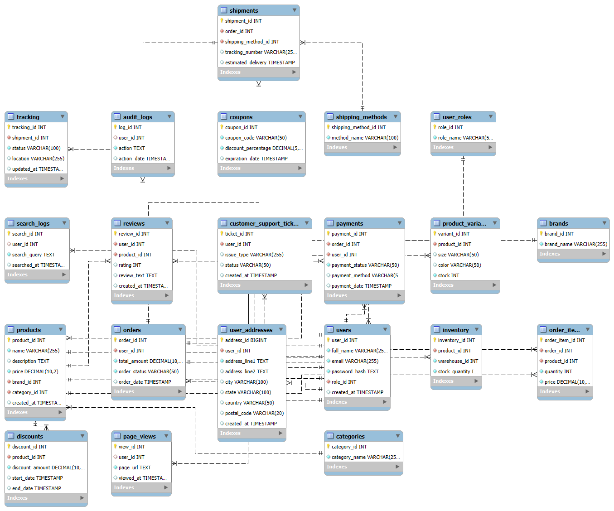

SQL Analytics for E-Commerce Database

## 1. Introduction
This repository presents a structured **SQL analytics project** designed for an **E-Commerce Database**. The project focuses on **analyzing key business insights** such as **customer behavior, revenue trends, product performance, and logistics efficiency** through SQL queries categorized into **Easy, Intermediate, and Hard** levels.

## 2. Repository Structure
- `EcommerceDatabaseCreation&DataLoad.sql` - SQL scripts for database schema creation.
- `data/` - dataset used for SQL queries.
- `queries/` - Collection of 60 structured SQL queries.
- `ecommerce_sql_analysis.tex` - LaTeX IEEE-format documentation.
- `EcommerceDatabase.png` - ER Diagram representation.
- `README.md` - Project documentation.

## 3. SQL Features
✅ **Easy Queries:** Basic SELECT, GROUP BY, COUNT, SUM, and AVG operations.  
✅ **Intermediate Queries:** Subqueries, CASE statements, ranking, and joins.  
✅ **Hard Queries:** CTEs, recursive queries, trend analysis, and window functions.  
✅ **Database Optimization:** Indexing, partitioning, and materialized views.  
✅ **Performance Enhancement:** Query execution plan analysis and data retrieval efficiency.

## 4. Setup Instructions
### 1️⃣ Clone the Repository
```bash
git clone https://github.com/Aravindpanchanathan2799/Ecommerce-Sql-Analytics/.git
cd ecommerce-sql-analytics
```
### 2️⃣ Import Database Schema
```sql
CREATE DATABASE ecommerce_db;
USE ecommerce_db;
SOURCE EcommerceAnalysis-I;
SOURCE EcommerceAnalysis-II;
SOURCE EcommerceAnalysis-III;
```
### 3️⃣ Load Sample Data
```sql
LOAD DATA INFILE 'data/Users_Data.csv' INTO TABLE users
FIELDS TERMINATED BY ',' ENCLOSED BY '"' LINES TERMINATED BY '\n'
IGNORE 1 ROWS;
```
### 4️⃣ Execute SQL Queries
```sql
SOURCE EcommerceAnalysis-I;
SOURCE EcommerceAnalysis-II;
SOURCE EcommerceAnalysis-III;
```

## 5. Entity-Relationship Diagram
The **ER Diagram** illustrates the **relational structure** of the database:



## 6. Documentation
The **IEEE LaTeX document (`ecommerce_sql_analysis.tex`)** includes:
- SQL Query Categorization
- Query Optimization Strategies
- Business Intelligence Insights
- Performance Enhancements

## 7. Acknowledgment
I acknowledge the assistance of **ChatGPT** in generating realistic datasets, which significantly streamlined database validation and query execution.

